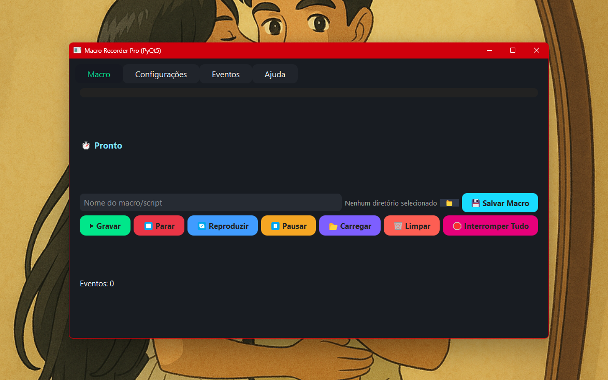

# 🖱️ Macro Recorder Pro

> **Grave e execute macros de mouse e teclado** — 100% Open Source, para Windows e Linux.

---

## 🚀 Funcionalidades

- **Grava**: movimentos do mouse, cliques, teclado e rolagem
- **Interface moderna**: feita em PyQt5 (dark mode de verdade)
- **Hotkeys globais** (teclas de atalho)*
- **Salva, carrega, repete** e ajusta velocidade das macros
- **Multi-plataforma** (Windows/Linux)

> ⚠️ *No Linux, hotkeys globais exigem rodar como root.*

---

## 📦 Instalação

### **Windows**

1. Instale o [Python 3](https://www.python.org/downloads/)
2. No terminal/cmd, rode:
    ```sh
    pip install pyqt5 pynput keyboard
    ```
3. (Opcional) Para gerar `.exe`:
    ```sh
    pip install pyinstaller
    pyinstaller --onefile --windowed macroqt5.py
    ```
    O executável estará em `dist\`.

---

### **Linux**

1. Instale Python 3 (geralmente já vem com o sistema)
2. No terminal:
    ```sh
    pip3 install pyqt5 pynput keyboard
    ```
3. Execute:
    ```sh
    python3 macroqt5.py
    ```
4. Para usar hotkeys globais:
    ```sh
    sudo python3 macroqt5.py
    ```

---

## 🎬 Como usar

1. Execute `macroqt5.py` (ou `macroqt5.exe`)
2. Use a interface para gravar, salvar e reproduzir suas macros!
3. Para detalhes, veja instruções na própria interface ou abaixo.

---

## 🖼️ Interface

> **Exemplo da interface:**  
> *(Adicione seu print abaixo desta linha!)*



---

## 📦 Releases

Baixe versões compiladas (.exe, .deb) na aba [Releases](https://github.com/SEUUSUARIO/macro-recorder-pro/releases).

---

## 📜 Licença

MIT – livre para uso, modificação e colaboração.

---

## 👨‍💻 Créditos

Desenvolvido por Rafael Lass.

---

## 🤝 Contribua!

Pull requests e sugestões são muito bem-vindos!  
Abra uma Issue ou mande seu PR.

---
